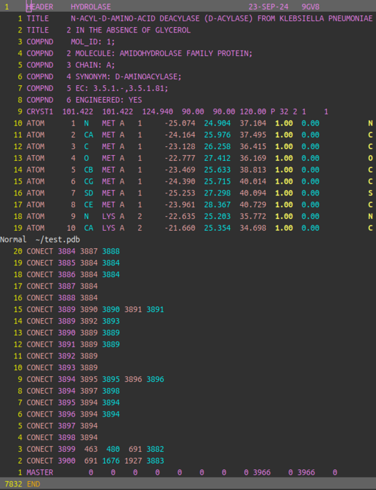
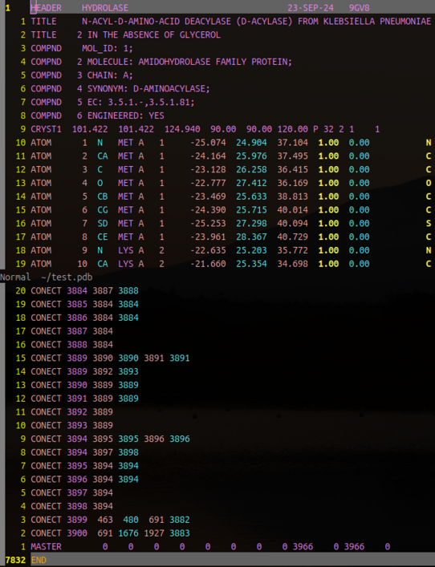
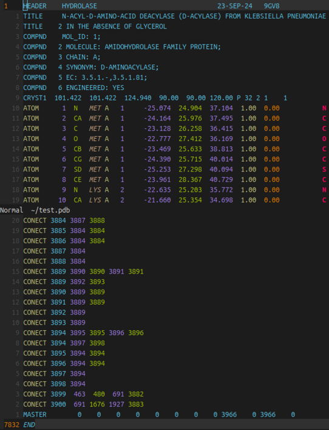
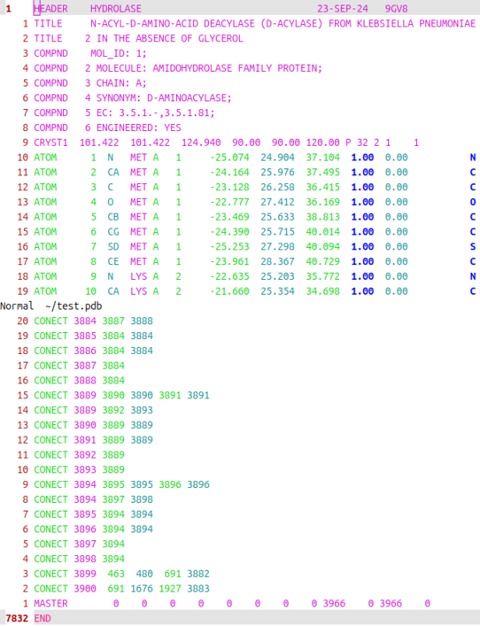
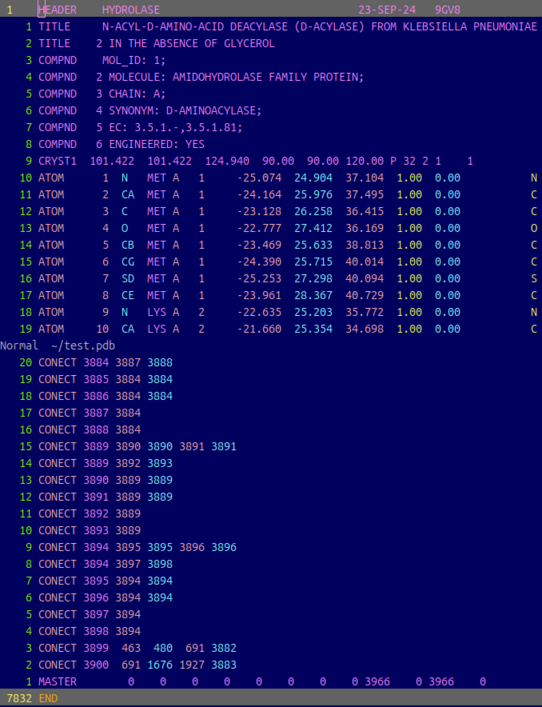

## Vim Syntax Highlight for PDB (Protein Data Bank) file

This is a shameless copy of the syntax file from [the blog post](https://mumeiyamibito.blogspot.com/2015/11/protein-data-bank-vim-syntax.html).  The original author is [@mumeiyamibito](https://twitter.com/mumeiyamibito).  
You can change color combinations based on your chosen colorscheme (e.g., with `:colorscheme desert`).

